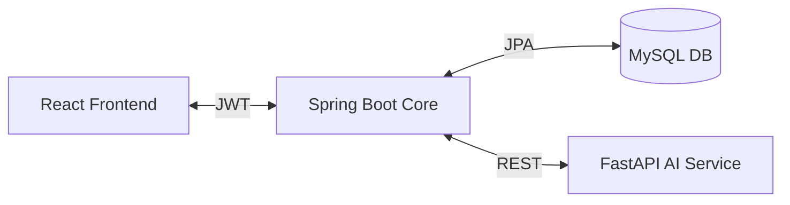
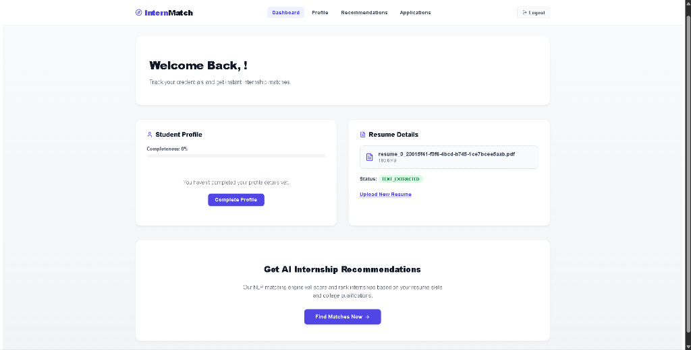
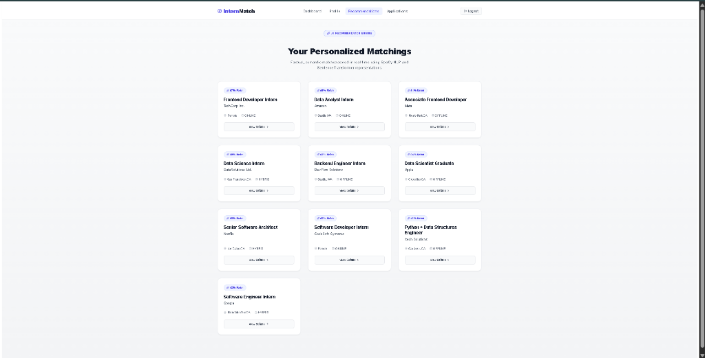

# InternMatch

A full-stack internship recommendation engine that automatically matches students with relevant software engineering and tech roles using natural language processing.
# InternMatch


## 📖 What is this?
Finding the right internship can often feel like throwing resumes into a void. Applicant Tracking Systems (ATS) typically rely on rigid keyword matching, meaning qualified candidates are frequently filtered out over minor terminology differences. 

InternMatch aims to fix this. It parses uploaded PDF resumes using spaCy, converts the extracted skills and experience into dense vector embeddings, and performs a semantic search against a curated database of tech internships. Instead of just looking for exact string matches, the system understands the context and relationships between different skills.

## 💡 Why I Built This
During my own internship search, I realized how much time students spend manually entering the exact same information into hundreds of different application portals, trying to guess which keywords the employer's ATS wants to see. I wanted to build a tool that flips the dynamic—something that reads my resume once, understands my actual technical background, and points me directly to the roles where I have the highest probability of succeeding. I also wanted to explore how Explainable AI (XAI) could make these automated decisions transparent rather than a black box.

## ⚡ Key Features
- **Smart Resume Parsing**: Drag-and-drop PDF extraction utilizing Named Entity Recognition (NER).
- **Semantic Matching**: Uses dense vector similarity rather than fragile keyword matching.
- **Explainable AI (XAI)**: Generates human-readable feedback detailing exactly why a student matched a specific role.
- **Microservice Architecture**: Decouples heavy AI inference workloads (Python/FastAPI) from transactional business logic (Java/Spring Boot).
- **JWT Authentication**: Secured via Spring Security and JSON Web Tokens for stateless session management.

## 📊 Project Statistics
- **Dataset Size**: ~1,000 technical internship postings
- **AI Model**: `sentence-transformers/all-MiniLM-L6-v2`
- **Recommendation Approach**: Hybrid Scoring Engine (Cosine Similarity + Skill Density + Education + Experience + Eligibility)

## 🔄 Recommendation Workflow
```text
Resume Upload
      ↓
Resume Parsing & NER
      ↓
Skill & Education Normalization
      ↓
Sentence Embedding Generation
      ↓
Semantic Similarity Search
      ↓
Hybrid Score Calculation
      ↓
Explainable AI Recommendation
```

## 🛠️ Technology Stack

| Layer | Technology |
|---|---|
| **Frontend** | React 18, Vite, Tailwind CSS |
| **Backend Core** | Java, Spring Boot 3.5, Spring Security |
| **AI Service** | Python, FastAPI, spaCy, Sentence-Transformers |
| **Database** | MySQL 8.0, Spring Data JPA |
| **Infrastructure** | Docker, Docker Compose |

## 📐 Architecture Overview



For detailed sequential flow diagrams, database schemas, and architectural rationale, please see the **[Architecture Guide](docs/ARCHITECTURE.md)**.

## 📂 Project Structure

```text
Internship-recommendation-engine/
├── ai-service/        # Python FastAPI: NLP, embeddings, hybrid scoring engine
├── backend/           # Java Spring Boot: Core REST API, JWT auth, database transactions
├── frontend/          # React Vite: SPA, user dashboard, protected routes
├── database/          # SQL schemas and curated seed data
└── docs/              # Comprehensive deployment & architecture guides
```

## 📸 Screenshots

### Student Dashboard


### AI Recommendations Grid


### Job Match


---

## 📖 Documentation Directory

The complete guide to installing, configuring, running, and deploying this project is maintained in the `docs/` directory:

* **[Installation Guide](docs/INSTALLATION.md)**: Setup prerequisites, environment variables, database seeding, and dependency installation.
* **[Running Guide](docs/RUNNING.md)**: Instructions for local development workflows and Docker Compose execution.
* **[Deployment Guide](docs/DEPLOYMENT.md)**: Strategies for deploying the platform to VPS and managed PaaS providers.
* **[Architecture](docs/ARCHITECTURE.md)**: Detailed system diagrams and workflow explanations.
* **[API Documentation](docs/API.md)**: Instructions for accessing Swagger/ReDoc interfaces and Postman collections.
* **[Dataset Engineering](docs/DATASET.md)**: Details on how the AI dataset is curated, filtered, and managed.
* **[Troubleshooting](docs/TROUBLESHOOTING.md)**: Solutions for common port, database, and dependency errors.
* **[Presentation Demo](docs/DEMO.md)**: A recommended script for demonstrating the project.
* **[Release Checklist](docs/RELEASE_CHECKLIST.md)**: QA verification required before creating a new public release.

---

## 🚀 Project Status
**Current Status**: Stable v1.0 (Actively Maintained)

While the core matching engine and UI are fully implemented, future work will focus on migrating to persistent vector databases (e.g. Pgvector), integrating LLMs for richer explanations, and building out recruiter-facing dashboards.

---

## 📄 License & Contribution
- **Author**: Sudhan
- **License**: This project is licensed under the [MIT License](LICENSE).
- **Contributing**: Please read the [Contributing Guidelines](CONTRIBUTING.md) and [Code of Conduct](CODE_OF_CONDUCT.md).
- **Security**: Report vulnerabilities according to our [Security Policy](SECURITY.md).

## ⭐ If you found this project useful, consider giving it a star.