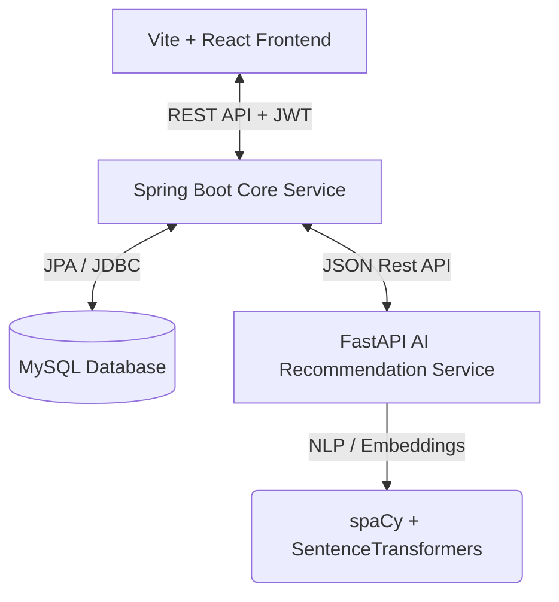
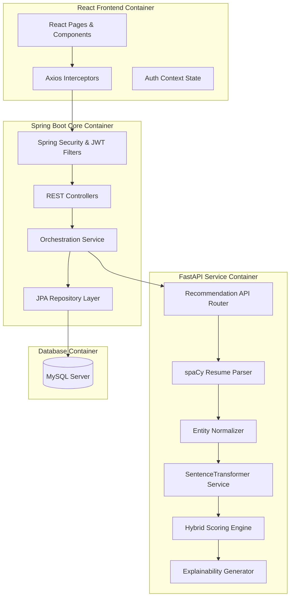
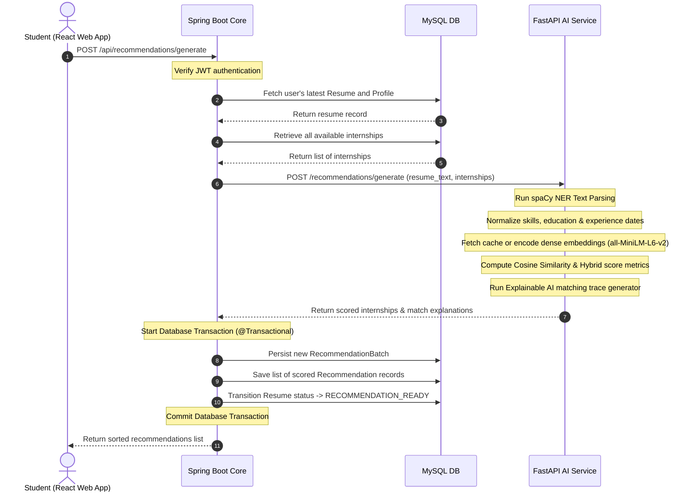
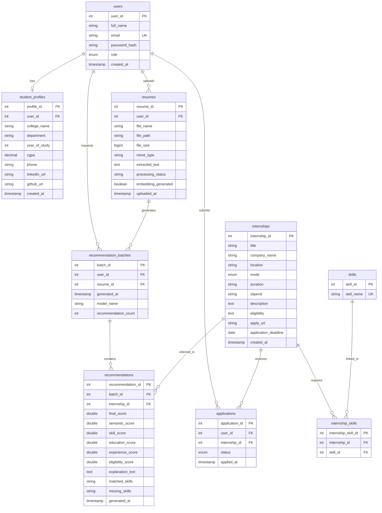
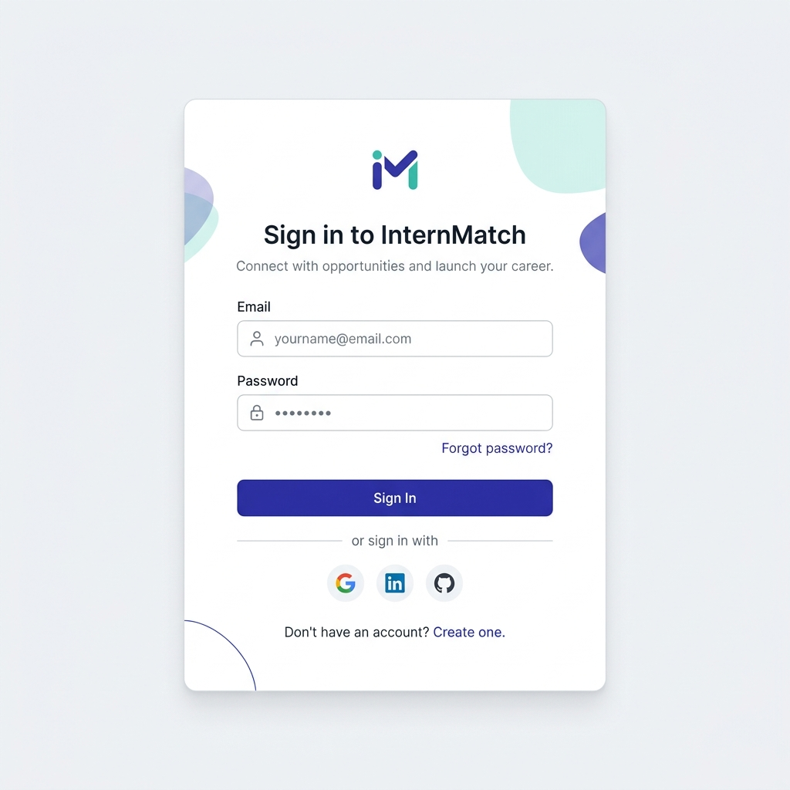
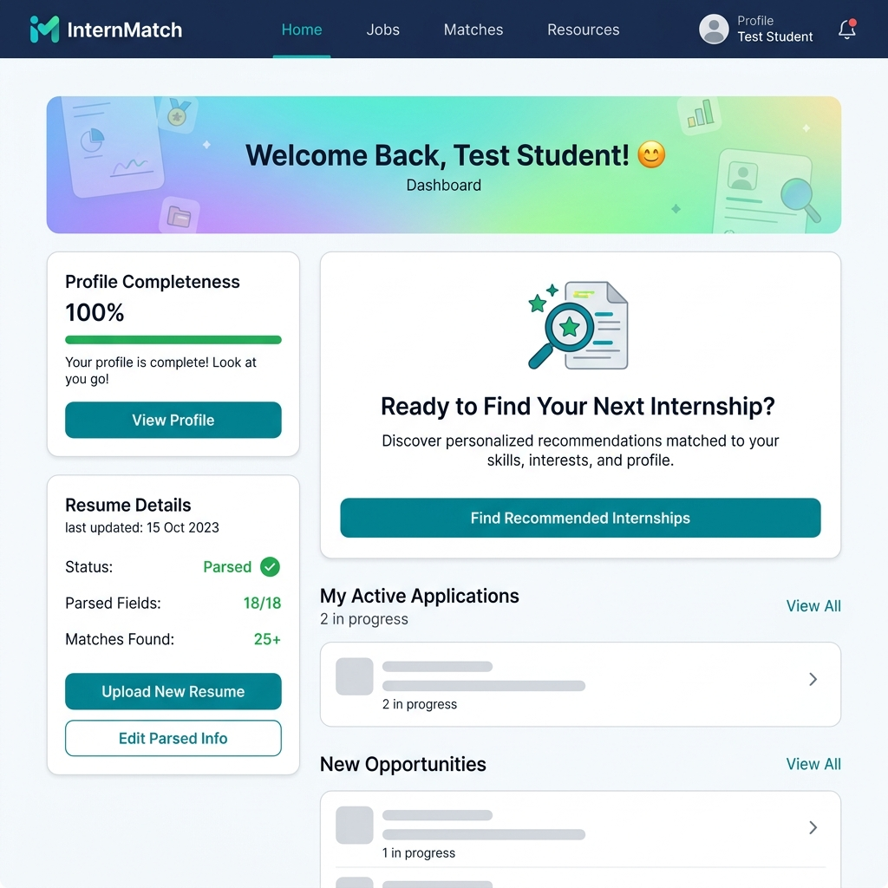
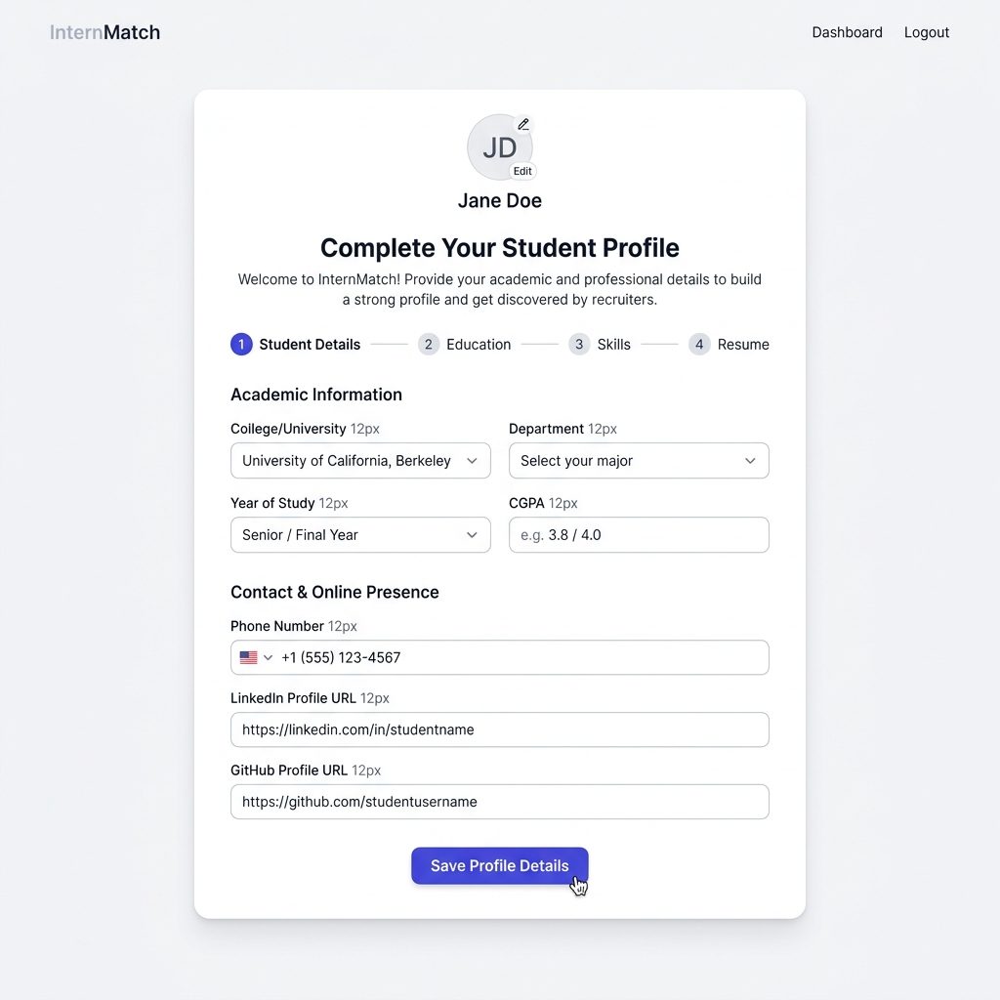
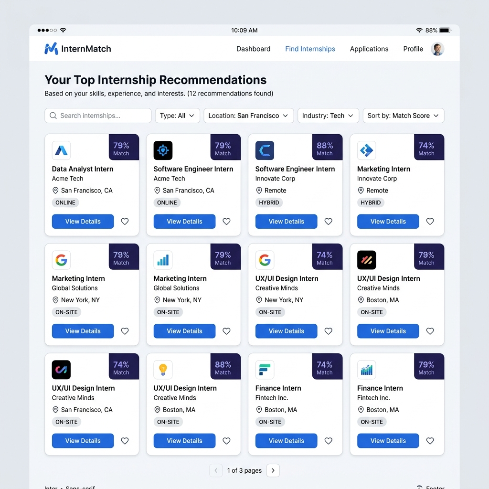
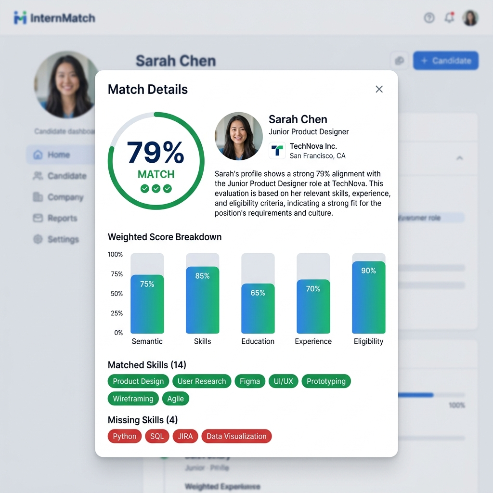
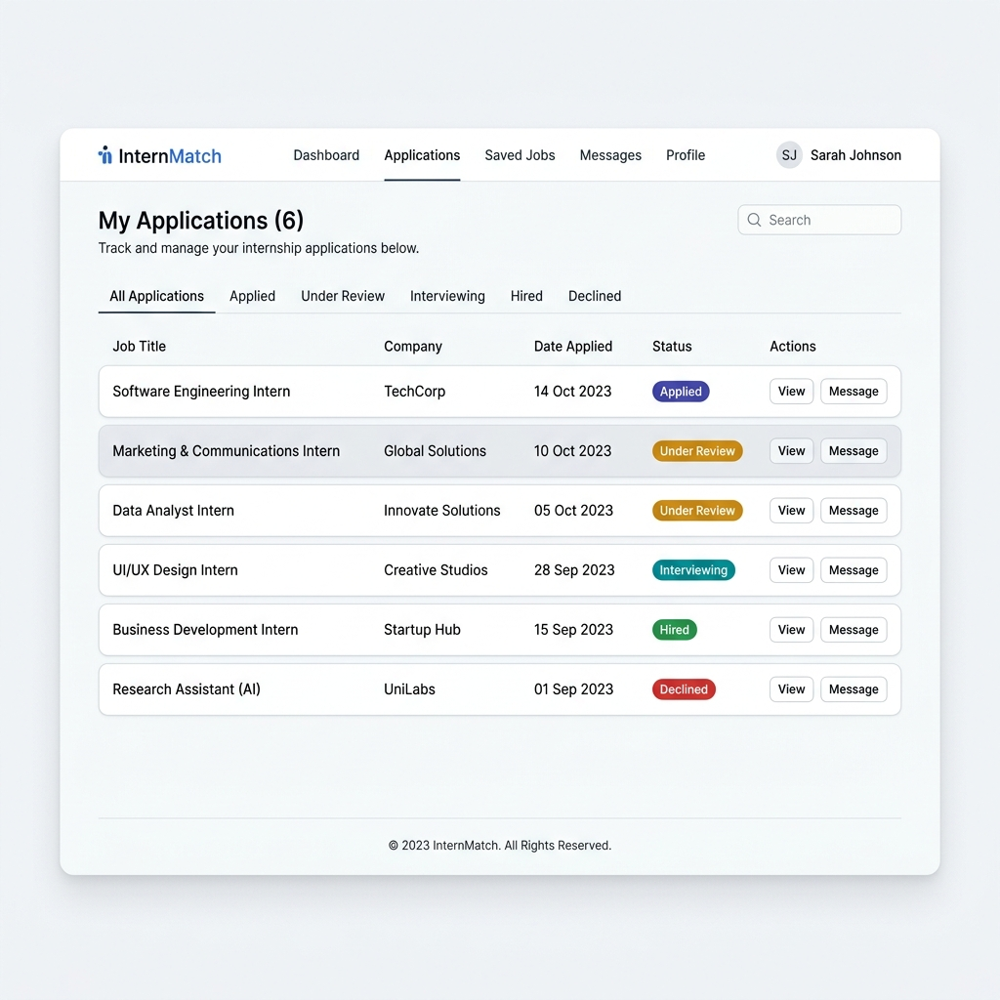

# InternMatch: AI-Based Internship Recommendation Engine

InternMatch is a production-grade, containerized web application that automates and optimizes the internship discovery process. By leveraging Natural Language Processing (NLP) and semantic vector representations, the platform extracts student skills from resumes and matches them with industry requirements, generating explainable recommendations in real time.

---

## 🚀 Key Features

### 👤 Student Dashboard
* **Secure Session Management**: JWT-based stateless authentication, registration, persistent sessions, and route guards.
* **Resume Parsing & Processing**: Drag-and-drop PDF upload with automatic layout-aware text extraction.
* **Intelligent Setup**: Complete profile management (GPA, college, department, GitHub/LinkedIn links) with real-time validations.
* **Explainable AI Recommendations**: Top 10 matched internships dynamically calculated based on semantic, skill, and eligibility density. Explains *why* the student matched with a breakdown of matching vs. missing criteria.
* **Application Tracker**: Apply for recommended listings and monitor progress statuses.

### 🤖 AI Recommendation Pipeline
* **Resume Parser**: Layout text scanning and spaCy NER classification mapping skills, education, experience, and projects.
* **Normalizer**: Cleans dates, normalizes school entities, and formats companies against canonical reference sets.
* **Embedding Service**: Maps text representations to dense vectors using a preloaded thread-safe SentenceTransformer model (`all-MiniLM-L6-v2`).
* **Hybrid Match Engine**: Evaluates cosine similarity, skill density overlap, educational qualifiers, and structural eligibility constraints.
* **Explainable AI (XAI)**: Generates human-readable Markdown explanations of the match logic.

### 📊 Dataset Engineering
* **Automated Curation**: The underlying recommendation engine relies on a pipeline of scripts that ingest raw public postings, clean HTML, scrub anomalies, and normalize skill texts.
* **Data Integrity**: Pre-ingestion validation ensures strict compliance with database schemas.

---

## 📐 System Architecture

### 1. High-Level Architecture


### 2. Component Diagram


### 3. AI recommendation Generation Sequence Diagram


### 4. Database Entity-Relationship (ER) Diagram


---

## 🛠️ Technology Stack

* **Frontend**: React 18, Vite, Axios, Tailwind CSS (for aesthetics), HTML5, CSS3, Context API.
* **Backend**: Spring Boot 3.5, Spring Security (Stateless JWT auth), Spring Data JPA.
* **AI Service**: Python 3.12, FastAPI, spaCy (NER parsing), Sentence-Transformers (`all-MiniLM-L6-v2`), Pandas.
* **Database**: MySQL 8.0.
* **Containerization**: Docker, Docker Compose.

---

## 📂 Project Structure

```
Internship-recommendation-engine/
├── ai-service/             # FastAPI NLP & Scoring Engine
│   ├── embedding/          # Vector encoding services & model loading
│   ├── nlp/                # spaCy parsing & NER extractors
│   ├── normalization/      # Entities cleanups & date mapping
│   ├── recommendation/     # Hybrid scoring & explanation logic
│   ├── routers/            # FastAPI API path definitions
│   ├── Dockerfile          # Python multi-stage container file
│   └── app.py              # Application entrypoint
├── backend/                # Spring Boot REST Core API
│   ├── src/main/java/      # MVC components, config, filters, controllers
│   ├── src/main/resources/ # application.properties configurations
│   ├── Dockerfile          # Java compilation and JRE multi-stage Dockerfile
│   └── pom.xml             # Maven dependencies
├── frontend/               # Vite React User Interface
│   ├── src/
│   │   ├── context/        # JWT context management
│   │   ├── components/     # ProtectedRoute, Header, UI widgets
│   │   └── pages/          # Auth, Dashboard, Profile, Recommendations, Applications
│   ├── Dockerfile          # Nginx production build Dockerfile
│   └── nginx.conf          # Router mapping configurations
├── database/               # SQL Schemas & Seed data
│   ├── schema.sql          # DB setup instructions
│   └── seed_data.sql       # Demo database populate instructions
├── docs/                   # Architectural graphics & Postman collection
│   ├── screenshots/        # High-fidelity dashboard & screen captures
│   └── postman_collection.json # API Collections import file
├── docker-compose.yml      # Multi-container orchestration configurations
└── .env.example            # Environment configuration template
```

---

## ⚙️ Configuration & Environment Variables

The project uses external configurations parameterized using standard environment variables with default values:

| Environment Variable | Description | Default Local Value | Docker Compose Service |
|---|---|---|---|
| `DB_URL` | MySQL Connection URL | `jdbc:mysql://localhost:3306/...` | `internmatch-db:3306` |
| `DB_USERNAME` | Database User | `root` | `root` |
| `DB_PASSWORD` | Database User Password | `Sudh@007` | `Sudh@007` |
| `JWT_SECRET` | Secret Token Signing Key | `internmatch_super_secret...` | *Static generated* |
| `JWT_EXPIRATION` | Expiry duration in ms | `86400000` (24 Hours) | `86400000` |
| `AI_SERVICE_URL` | FastAPI service path | `http://localhost:8000` | `http://ai-service:8000` |

---

## 📖 Documentation Directory

The complete guide to installing, configuring, running, and deploying this project has been moved to the `docs/` directory to keep this README concise.

Please refer to the following comprehensive guides:

* **[Installation Guide](docs/INSTALLATION.md)**: Setup prerequisites, environment variables, database seeding, and dependency installation.
* **[Running Guide](docs/RUNNING.md)**: Instructions for local development workflows (FastAPI + Spring Boot + React) and Docker Compose execution.
* **[Deployment Guide](docs/DEPLOYMENT.md)**: Strategies for deploying the platform to VPS and managed PaaS providers (Render, Railway, Vercel).
* **[Architecture](docs/ARCHITECTURE.md)**: Detailed system diagrams and workflow explanations.
* **[API Documentation](docs/API.md)**: Instructions for accessing Swagger/ReDoc interfaces and Postman collections.
* **[Dataset Engineering](docs/DATASET.md)**: Details on how the AI dataset is curated, filtered, and managed.
* **[Troubleshooting](docs/TROUBLESHOOTING.md)**: Solutions for common port, database, and dependency errors.
* **[Presentation Demo](docs/DEMO.md)**: A recommended script for demonstrating the project.
* **[Release Checklist](docs/RELEASE_CHECKLIST.md)**: QA verification required before creating a new public release.

---

## 📸 High-Fidelity UI Screens

### 1. Login Page
*Stateless JWT Session creation, client-side input safety checks.*


### 2. Student Dashboard
*Welcome layout, profile setup tracking status, and resume PDF upload.*


### 3. Profile Setup Page
*CGPA, department, year of study inputs and real-time backend constraints verification.*


### 4. AI Recommendations Grid
*Real-time AI recommendations displaying match score percentages and metadata sorting.*


### 5. Match Details & Explainable AI Modal
*Dynamic score breakdown chart and natural language XAI reasoning description.*


### 6. Applications Tracker
*Interactive list tracking submitted internship applications and processing status.*


---

## 🔮 Future Improvements

1. **Persistent Vector Store**: Migrate in-memory similarity repositories to persistent vector databases (e.g. Pgvector or Qdrant) for high scalability.
2. **Advanced Language Models**: Integrate LLMs (e.g. LLaMA or Gemini APIs) to extract complex semantics and write highly contextual feedback.
3. **Admin Dashboard Analytics**: Incorporate a portal for employers and recruiters to monitor applications and review matching recommendations.
4. **Real-time WebSockets**: Push notifications to student devices when applications transition to SHORTLISTED or ACCEPTED.

---

## 📄 License & Contribution
- **Author**: Sudhan
- **License**: This project is licensed under the [MIT License](LICENSE).
- **Contributing**: Please read the [Contributing Guidelines](CONTRIBUTING.md) and [Code of Conduct](CODE_OF_CONDUCT.md).
- **Security**: Report vulnerabilities according to our [Security Policy](SECURITY.md).
