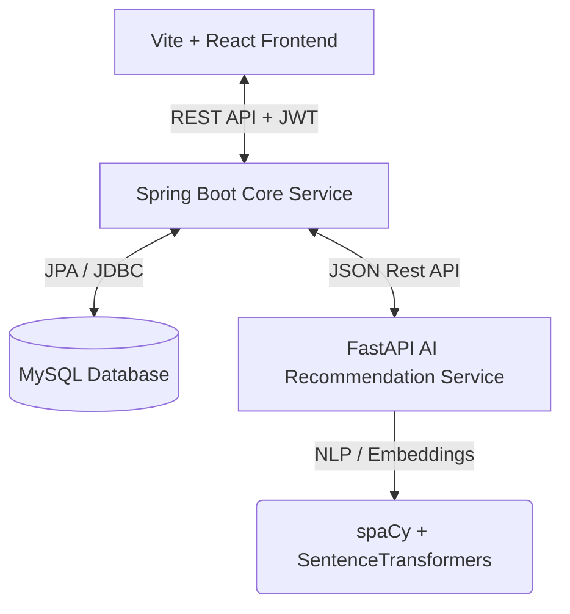
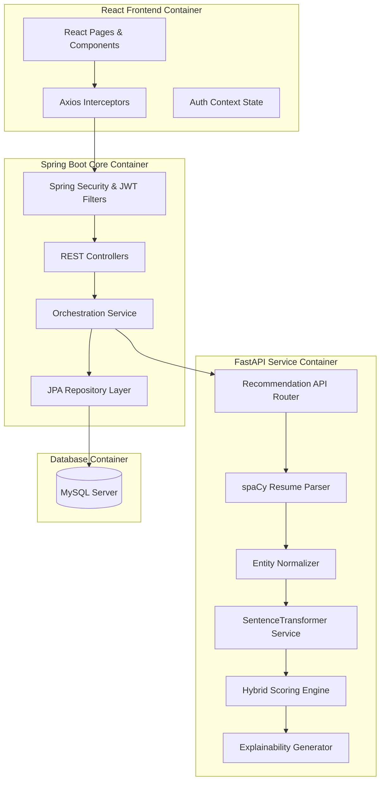
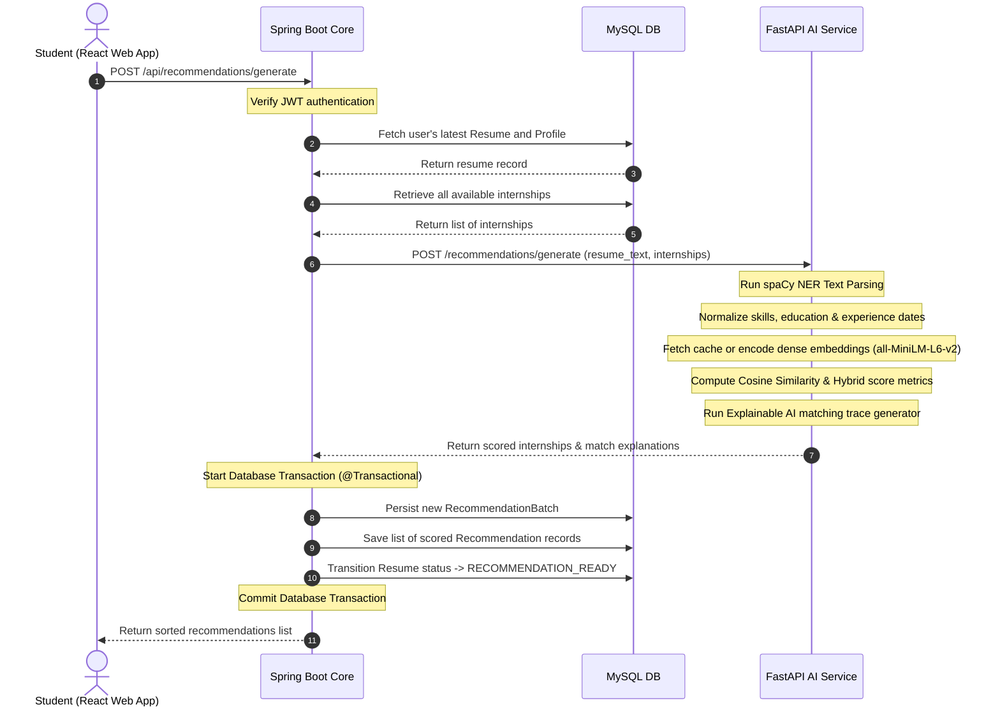

# System Architecture

InternMatch is designed as a hybrid-microservice architecture that separates heavy Natural Language Processing (NLP) workloads from transactional web requests.

## 1. High-Level Architecture
The architecture comprises three main application tiers communicating securely over REST.

## 2. Component Subsystems
To ensure maintainability and separation of concerns, the application is divided into distinct containers:

## 3. The Recommendation Workflow
The AI Recommendation pipeline involves a complex synchronization between the transactional database and the stateless AI inference engine.

## 4. Rationale
- **Spring Boot Core:** Java is utilized for the primary backend due to its robust ecosystem for handling transactional safety (`@Transactional`), complex relational mappings (JPA/Hibernate), and enterprise-grade security (Spring Security/JWT).
- **FastAPI AI Service:** Python is the undisputed leader in AI/ML ecosystems. Attempting to run spaCy and Hugging Face models in Java would be highly inefficient. FastAPI provides an asynchronous, lightning-fast bridge to expose these Python data-science models to the Java backend.
- **Batch Persistence:** Recommendations are generated dynamically but are persisted in MySQL linked to a `batch_id`. This allows the student to log off and return later to instantly view their cached recommendations without regenerating the embeddings.
