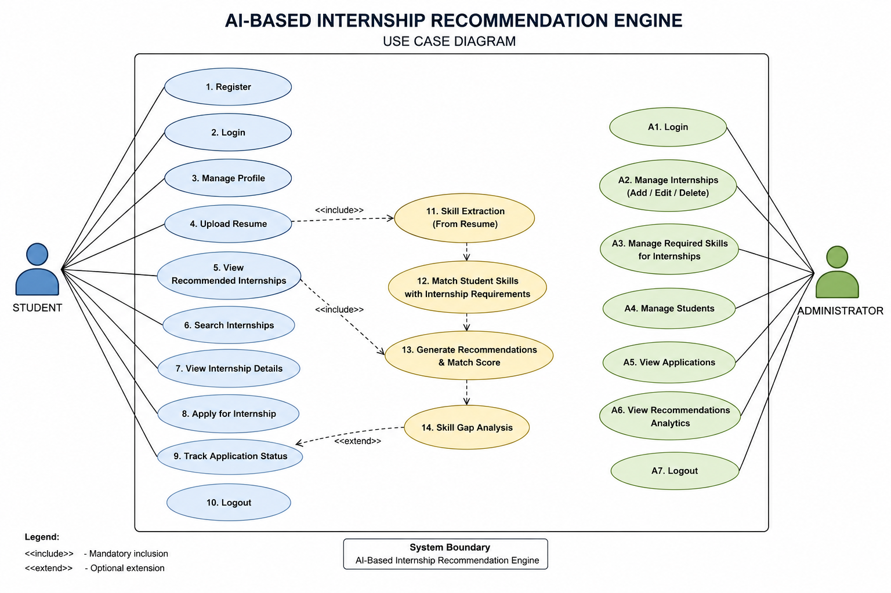
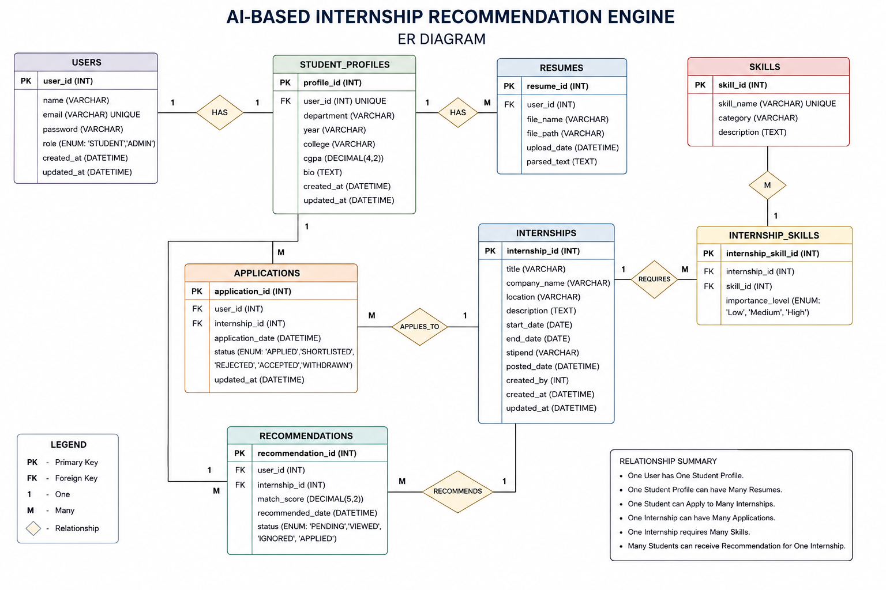

# Project Documentation

# AI-Based Internship Recommendation Engine

---

# Project Information

| Field             | Value                                      |
| ----------------- | ------------------------------------------ |
| Project Name      | AI-Based Internship Recommendation Engine  |
| Domain            | Artificial Intelligence & Machine Learning |
| Type              | Web Application                            |
| Status            | Design Phase Completed                     |
| Development Model | Incremental Development                    |

---

# Project Timeline

| Day | Activity                      | Deliverable        | Status |
| --- | ----------------------------- | ------------------ | ------ |
| 01  | Project Title Finalization    | Approved Title     | ✅      |
| 02  | Requirement Gathering         | Problem Statement  | ✅      |
| 03  | Objective Definition          | Project Objectives | ✅      |
| 04  | User & Module Identification  | Module List        | ✅      |
| 05  | Use Case Diagram Preparation  | Use Case Diagram   | ✅      |
| 06  | Database Requirement Analysis | Table List         | ✅      |
| 07  | ER Diagram Design             | ER Diagram         | ✅      |
| 08  | Database Schema Creation      | SQL Schema         | ✅      |
| 09  | UI Wireframe Design           | Page Layouts       | ✅      |
| 10  | Login & Dashboard UI Design   | UI Screens         | ✅      |
| 11  | Navigation & Form Design      | UI Prototype       | ✅      |
| 12  | Design Review                 | Design Approval    | ✅      |

---

# Day 01 - Project Title Finalization

### Approved Title

**AI-Based Internship Recommendation Engine**

### Deliverable

Approved Project Title

---

# Day 02 - Requirement Gathering

## Problem Statement

Students often face difficulties in identifying internship opportunities that match their skills, academic background, and career interests. Existing internship platforms provide numerous listings but lack personalized recommendations, making the internship search process time-consuming and inefficient.

An intelligent recommendation system is required to analyze student profiles and suggest suitable internships based on skill matching and profile compatibility.

### Deliverable

Problem Statement

---

# Day 03 - Objective Definition

## Project Objectives

* Build a centralized internship recommendation platform.
* Recommend internships based on student skills.
* Simplify internship discovery.
* Improve internship relevance and matching.
* Provide application tracking functionality.
* Assist students in identifying missing skills.
* Provide internship management features for administrators.

### Deliverable

Project Objectives

---

# Day 04 - User & Module Identification

## Users

### Student

* Register Account
* Login
* Upload Resume
* View Recommendations
* Apply for Internships
* Track Applications

### Administrator

* Manage Internship Listings
* Manage Student Data
* Monitor Recommendations
* View Analytics

---

## Modules

### User Management Module

Handles registration, login, and profile management.

### Internship Management Module

Handles internship creation and management.

### Recommendation Module

Handles internship matching and recommendation generation.

### Application Tracking Module

Tracks internship applications.

### Administration Module

Provides administrative controls.

### Deliverable

Module List

---

# Day 05 - Use Case Diagram Preparation

## Student Use Cases

* Register
* Login
* Manage Profile
* Upload Resume
* View Recommendations
* Search Internships
* Apply for Internship
* Track Application Status

## Admin Use Cases

* Login
* Add Internship
* Edit Internship
* Delete Internship
* View Students
* View Reports

### Deliverable

---

# Day 06 - Database Requirement Analysis

## Table List

### Users

Stores authentication information.

### Student_Profiles

Stores academic and personal information.

### Skills

Stores available skills.

### Internships

Stores internship opportunities.

### Internship_Skills

Maps internships to required skills.

### Recommendations

Stores generated recommendations.

### Applications

Stores internship applications.

### Admin

Stores administrator accounts.

### Deliverable

Table List

---

# Day 07 - ER Diagram Design

---

# Day 08 - Database Schema Creation

## Planned Tables

### users

* user_id
* name
* email
* password
* role

### student_profiles

* profile_id
* user_id
* department
* year
* cgpa

### skills

* skill_id
* skill_name

### internships

* internship_id
* title
* company
* location
* description

### internship_skills

* internship_id
* skill_id

### recommendations

* recommendation_id
* user_id
* internship_id
* match_score

### applications

* application_id
* user_id
* internship_id
* status

### admin

* admin_id
* username
* password

### Deliverable

SQL Schema

---

# Day 09 - UI Wireframe Design

## Planned Pages

### Landing Page

Project introduction and navigation.

### Login Page

User authentication.

### Registration Page

Student registration.

### Dashboard

Student overview.

### Internship Recommendation Page

Recommended internships list.

### Internship Details Page

Detailed internship information.

### Admin Dashboard

Administrative controls.

### Deliverable

Page Layouts

---

# Day 10 - Login & Dashboard UI Design

## Login Screen

Features:

* Email
* Password
* Login Button
* Register Link

---

## Dashboard Screen

Features:

* Student Information
* Recommended Internships
* Application Summary
* Skill Overview

### Deliverable

UI Screens

---

# Day 11 - Navigation & Form Design

## Navigation Menu

### Student

* Dashboard
* Recommendations
* Applications
* Profile

### Admin

* Dashboard
* Internships
* Students
* Reports

---

## Forms

### Registration Form

* Name
* Email
* Password

### Internship Form

* Title
* Company
* Description
* Required Skills

### Deliverable

UI Prototype

---

# Day 12 - Design Review

## Design Validation

### Requirements Review

✅ Completed

### Module Review

✅ Completed

### Database Review

✅ Completed

### UI Review

✅ Completed

### Architecture Review

✅ Completed

---

## Approval Status

Design Approved for Development Phase

### Deliverable

Design Approval

---

# Current Project Status

### Analysis Phase

✅ Completed

### Design Phase

✅ Completed

### Frontend Development

⏳ Ready to Start

### Backend Development

⏳ Ready to Start

### Integration

⏳ Pending

### Testing

⏳ Pending

### Final Submission

⏳ Pending

---

# Version History

| Version | Description                          |
| ------- | ------------------------------------ |
| v0.1    | Project Documentation Initialized    |
| v1.0    | Requirement & Design Phase Completed |

---
